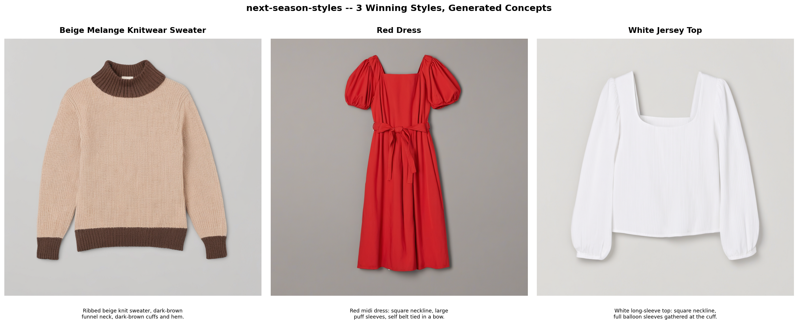
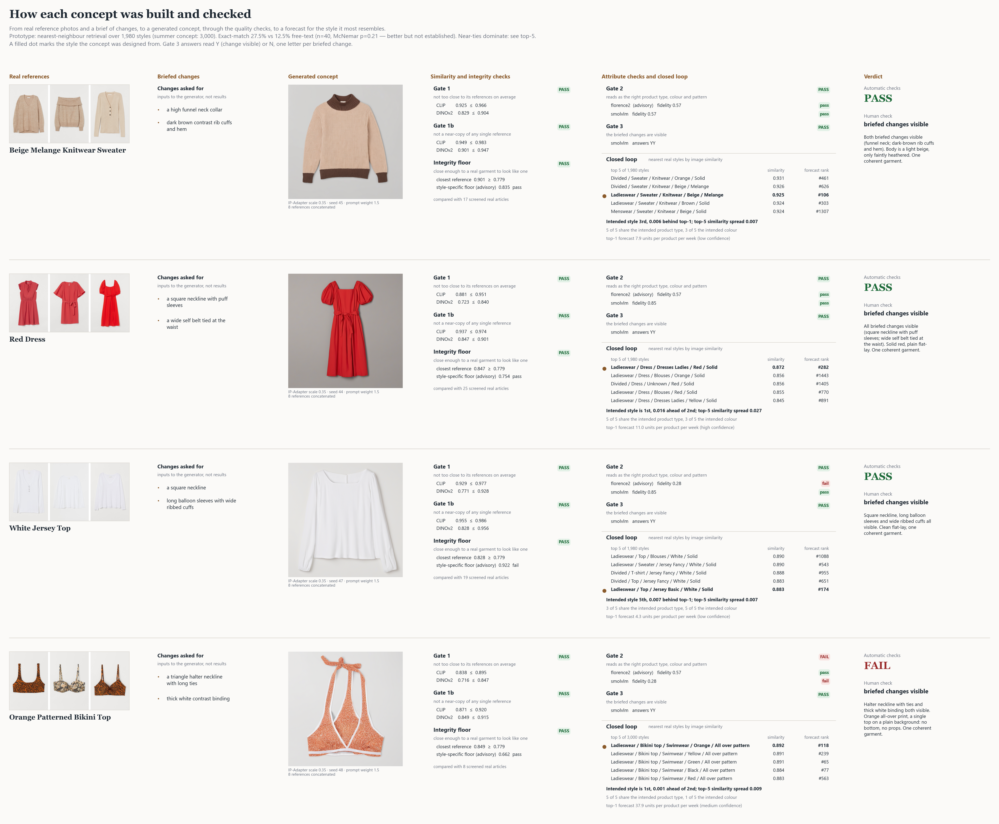

# next-season-styles

Forecast which H&M fashion styles will sell best next season, then generate and check new design concepts for them.



## What this does

From two years of H&M transactions I build a weekly panel of "styles" (garment type, colour and pattern together) and train a LightGBM model to forecast which will sell best over the next 13 weeks. For the top forecast styles I write a design brief, generate new concept images with SDXL conditioned on real reference photos, and check each one against similarity, integrity and attribute tests plus a human look. The same steps are exposed as sub-agents, two reusable Claude Agent Skills and an MCP server.

## Headline result

Under a 13-week training embargo, the model's predicted top 3 land in the true top 20 (Hit@3-in-top20) **0.528** of the time over 12 walk-forward origins. That is comparable to seasonal-naive on top-k (paired difference +0.233, 95% CI [0.000, 0.567]), better on NDCG@10, Spearman and WMAPE, and clearly ahead of EWMA persistence and the naive means.

My first number, 0.722, trained on labels that overlap the test window and was wrong; the write-up shows how I found that and what changed. Full argument and limits: [`reports/WRITEUP.md`](reports/WRITEUP.md). Sources: `reports/tables/backtest_embargo_summary.csv`, `backtest_embargo_paired_diff.csv` and `backtest_embargo_check.csv` (last regenerated in commits `a6cc769` and `06d22c3`).

Of the four concepts, the sweater and the dress pass every automatic check and a human check. The white top fails the integrity floor and one automatic check, and the summer bikini top fails one automatic check on one reader's answer; I did not loosen any check to hide that. How each concept was built and judged:



For a non-specialist walk-through, open [`reports/DEMO.html`](reports/DEMO.html) in a browser (self-contained, no server). Requirement-by-requirement mapping: [`reports/SUBMISSION_CHECKLIST.md`](reports/SUBMISSION_CHECKLIST.md).

## Repo map

| Path | What is there |
|---|---|
| `src/nss/features/` | Style-week panel construction, causal feature set, style-key validation |
| `src/nss/models/` | Rolling-origin backtest harness, baselines, random floor, LightGBM, embargo checks, final forecast |
| `src/nss/generate/` | SDXL / IP-Adapter generation, CLIP and DINOv2 scoring, VLM judges, quality-check pipeline |
| `src/nss/mcp_server.py` | The 8-tool MCP server |
| `src/nss/demo_backtest.py` | Runs the real backtest harness on a synthetic panel, no dataset needed |
| `agents/` | Sub-agent role definitions (orchestrator, data analyst, forecaster, style profiler, concept designer, critic) |
| `skills/` | Two dataset-agnostic Claude Agent Skills: `style-brief/` and `concept-qc/` |
| `scripts/` | `run_pipeline.py` (end-to-end run, with a CPU `--dry-run`), `agent_demo.py`, `mcp_smoke_test.py` |
| `reports/` | `WRITEUP.md`, `DEMO.html`, `figures/`, `tables/` (every table the write-up cites), `agent_run_transcript.md`, `SUBMISSION/` (the reviewer bundle as sent) |
| `tests/` | pytest suite; tests that need the dataset skip with a message when it is absent |
| `data/` | Gitignored data tiers (`raw/`, `interim/`, `processed/`, `images/`, `generated/`) |

## Quickstart

Uses [uv](https://github.com/astral-sh/uv); `uv.lock` is committed. The install pulls PyTorch and the diffusion stack, so it is large.

```
uv sync
```

**macOS or CPU-only machines:** `pyproject.toml` pins `torch` and `torchvision` to the CUDA 13.0 index (`pytorch-cu130`), and I have only verified `uv sync` as written on Windows. If it does not resolve on your platform, skip those two packages and install CPU builds yourself; nothing below needs CUDA except full generation. On macOS drop the `--index-url` option so PyPI's build is used. Afterwards run commands with `uv run --no-sync` so uv does not reinstall the pinned builds:

```
uv sync --frozen --no-install-package torch --no-install-package torchvision
uv pip install torch torchvision --index-url https://download.pytorch.org/whl/cpu
uv run --no-sync python -m nss.demo_backtest
```

I ran exactly this on Windows (CPU torch 2.14.0; demo and 83 tests passed); I have not run it on macOS or Linux.

**1. No dataset, no GPU: run the real evaluation harness on synthetic data (about 15 seconds on my machine).**

```
uv run python -m nss.demo_backtest
```

This builds a panel from a small committed synthetic fixture (`src/nss/demo_data/`, 200 toy styles, 106 weeks), then runs the same rolling-origin backtest code the results come from: the four baselines, LightGBM trained under the 13-week embargo, the random-permutation floor, and paired block-bootstrap comparisons. **The numbers it prints are from synthetic data. They show that the machinery runs, not what H&M's sales do, and they are not the reported results.**

**2. Tests (no dataset needed).**

```
uv run pytest
```

Tests that need the H&M data or the fetched reference images skip with a message naming the missing file.

**3. With the H&M data.** Download the [H&M Personalized Fashion Recommendations](https://www.kaggle.com/competitions/h-and-m-personalized-fashion-recommendations) files `articles.csv` and `transactions_train.csv` into `data/raw/` (Kaggle credentials and accepting the competition rules are required; I have not scripted this step, and an earlier version of this README pointed at a download script that was never committed). Then:

```
uv run python -m nss.data.convert_transactions   # transactions_train.csv -> partitioned parquet
uv run python -m nss.features.style_panel        # -> data/processed/style_week_panel.parquet
uv run --no-sync python scripts/run_pipeline.py --dry-run   # every stage on CPU, ~1-2.5 minutes
```

`--dry-run` writes only under a scratch directory, skips SDXL generation (the committed final concepts are scored instead) and disables the VLM judges, so attribute checks are skipped and the printed verdicts read "did not pass"; the similarity numbers are real. It also downloads about 16 product photos. The full run (`scripts/run_pipeline.py` without `--dry-run`) needs a CUDA GPU and writes to `reports/pipeline_run/` (gitignored), never over the committed deliverables. Individual stages have their own `make` targets; see the `Makefile`.

**Rebuilding the retrieval embedding cache** (`data/retrieval_cache/emb_clip.npz`, `emb_dino.npz`): `uv run python -m nss.generate.concept_forecast_index`. Reads catalogue photos in place, read-only, from the local H&M image tree (`NSS_HM_IMAGE_TREE`, else a sibling project's checkout); a rerun is cheap, since already-cached photos are skipped.

## Known limits

- The embargo shrinks the training sets, so the drop from 0.722 to 0.528 mixes leakage with lost data; the write-up says so.
- The label-shuffle control (0 hits in 108 picks) does not detect this kind of leak.
- A second model without COVID-overlapping training rows was no better (`reports/tables/covid_two_model_comparison.csv`).
- The local judges are small (the design-change reader says yes too easily), so a human check decides; the closed-loop retrieval is a prototype (27.5% exact-style match against 12.5% for the earlier caption-based version, n=40, McNemar p=0.21).
- Everything else that did not work, and what I could not verify, is in section 9 of the write-up.

Generation needed real work: an earlier round produced no briefed design change in 12 images, and the cause was measured rather than assumed (`reports/tables/prompt_lever_summary.md`).

Commands here were developed with Git Bash from PowerShell on Windows 11; `make` targets and `uv` commands are shell-agnostic.

## Corrections since submission

The random-permutation floor in the backtest tables was not stable across processes. `build_predictions_frame` did not fix row order, and the floor permutes the true values in row order, so its Hit@3-in-top20 came out anywhere from 0.004 to 0.011 between runs (0.0111 in the tables I submitted). Rows are now sorted by origin and style key; three separate processes produce byte-identical output, and the floor is 0.0069. The conclusion is unchanged: about 0.01 against the model's 0.528. LightGBM, EWMA persistence, seasonal-naive and parent-category-mean numbers did not move. The `global_mean` baseline predicts a single value per origin, so its top-10 metrics depend only on how ties are ordered: its NDCG@10 is now 0.203 where an arbitrary order gave 0.403, and it carries no ranking information either way. The write-up and the submission bundle quote neither number and are unchanged. Regenerated: `backtest_embargo_*`, `backtest_summary_v2`, `backtest_paired_diff`, `label_shuffle_control`, `lambdarank_vs_l2_comparison`. Not regenerated, so their floor and global-mean comparator rows are still the earlier draws: `neighbourhood_*`, `buyer_price_*` (both rejected-feature experiments) and the pre-Hit@k `backtest_per_origin.csv` / `backtest_summary.csv`. One cell of `backtest_paired_diff.csv` differs by a last-digit float step (about 1e-17) between two full reruns; I did not track down its source.

## MCP server

`src/nss/mcp_server.py` exposes 8 tools (transaction queries, style profiles/SHAP
drivers, pre-computed forecasts, reference images, concept generation, concept scoring,
concept-sheet composition and the closed-loop concept forecast) over the **stdio** transport of the official
[MCP Python SDK](https://github.com/modelcontextprotocol/python-sdk) (`mcp` package). Every tool
reads artifacts already on disk — modelling is frozen; nothing here retrains a model or re-runs a
backtest. `generate_concept` performs live GPU (or paid-API) work when invoked, and `score_concept`
runs the quality checks live (CLIP/DINOv2 on CPU; an optional Groq call for Gate 2).

Run it standalone:

```
uv run python -m nss.mcp_server
```

Point any standard MCP client (Claude Desktop, or any other MCP-compatible client) at it with an
`mcpServers` config block like this (adjust `cwd` to wherever this repo is checked out):

```json
{
  "mcpServers": {
    "next-season-styles": {
      "command": "uv",
      "args": ["run", "--no-sync", "python", "-m", "nss.mcp_server"],
      "cwd": "/absolute/path/to/next-season-styles"
    }
  }
}
```

For Claude Desktop specifically, add that block to `claude_desktop_config.json` (macOS:
`~/Library/Application Support/Claude/claude_desktop_config.json`; Windows:
`%APPDATA%\Claude\claude_desktop_config.json`) and restart the app.

### Verify it works (repeatable smoke test)

`scripts/mcp_smoke_test.py` reads the `mcpServers` block above **as written** (only the documented
`cwd` placeholder is replaced with your checkout path), launches the server with that command over
stdio, connects a real MCP client, and calls `forecast_styles`, `get_style_profile` and `score_concept`. It needs the
`data/` artifacts the tools read (Quickstart, step 3) and exits 0 on success; on a clean clone
without them it prints that it was not run and exits 2:

```
uv run --no-sync python scripts/mcp_smoke_test.py
```

Expected output (captured from a real run; long lists are elided by the script and say so; paths
under `<your checkout>` are yours). `score_concept` runs the quality checks on the committed
sweater concept: Gate 1, Gate 1b and the integrity floor pass (the exact-clone control fails as
required), Gates 2 and 3 are not run by default, and the human visual check is always required:

```
launching: uv run --no-sync python -m nss.mcp_server  (cwd=<your checkout>)
tools: ['compose_final_sheet', 'forecast_concept', 'forecast_styles', 'generate_concept', 'get_reference_images', 'get_style_profile', 'query_transactions', 'score_concept']
forecast_styles -> [
  {
    "rank": 1,
    "style_key": "Ladieswear || T-shirt || Jersey Basic || Black || Solid",
    "index_group_name": "Ladieswear",
    "product_type_name": "T-shirt",
    "garment_group_name": "Jersey Basic",
    "perceived_colour_master_name": "Black",
    "graphical_appearance_name": "Solid",
    "predicted_intensity": 33.773553456977744,
    "guard1_pass": true,
    "guard1_n_active_articles_trailing_mean": 23.0,
    "guard2_pass": true,
    "guard2_price_index": 1.0589412126425564,
    "guard3_pass": true,
    "guard3_n_weeks_active_trailing": 52,
    "shap_driver_1_feature": "lag_1",
    "shap_driver_1_value": 0.7287921107138857,
    "shap_driver_2_feature": "n_active_articles_level",
    "shap_driver_2_value": 0.2011520713462187,
    "shap_driver_3_feature": "fourier_sin_1",
    "shap_driver_3_value": -0.12149169600317132,
    "shap_driver_4_feature": "garment_group_name",
    "shap_driver_4_value": 0.11608373485876344,
    "shap_driver_5_feature": "perceived_colour_master_name",
    "shap_driver_5_value": 0.11324089707198806,
    "_forecast_origin_date": "2020-09-21",
    "_forecast_horizon_weeks": 13,
    "_requested_origin_date": "2020-09-21",
    "_requested_horizon_weeks": 13
  }
]
get_style_profile -> {
  "style_key": "Ladieswear || T-shirt || Jersey Basic || Black || Solid",
  "attributes": {
    "index_group_name": "Ladieswear",
    "product_type_name": "T-shirt",
    "garment_group_name": "Jersey Basic",
    "perceived_colour_master_name": "Black",
    "graphical_appearance_name": "Solid"
  },
  "trajectory": {
    "available": true,
    "first_week_seen": "2018-09-17",
    "last_week_seen": "2020-09-21",
    "n_weeks_total": 106,
    "recent_weeks": [
      {
        "week_start": "2020-06-29",
        "units": 1857,
        "revenue": 21.284440677966103,
        "price_index": 0.9931281941617366,
        "intensity_shrunk": 66.75452732393227
      },
      {
        "week_start": "2020-07-06",
        "units": 1591,
        "revenue": 17.791305084745762,
        "price_index": 0.9689304409646231,
        "intensity_shrunk": 59.63597755238108
      },
      "... 11 more entries elided"
    ],
    "recent_mean_units": 1564.6923076923076,
    "recent_mean_revenue": 19.329864406779663
  },
  "shap_drivers": {
    "source": "reports\\tables\\top_styles_incumbent.csv",
    "style_specific": true,
    "drivers": [
      {
        "feature": "lag_1",
        "value": 0.7287921107138857
      },
      {
        "feature": "n_active_articles_level",
        "value": 0.2011520713462187
      },
      "... 3 more entries elided"
    ],
    "note": null
  }
}
score_concept -> {
  "concept_path": "<your checkout>\\reports\\concepts\\beige-knit-sweater_s0.35_seed45.png",
  "style_key": "Ladieswear || Sweater || Knitwear || Beige || Melange",
  "n_references": 17,
  "gate1": {
    "pass": true,
    "clip": {
      "similarity": 0.925444294424618,
      "limit_p90_of_real_pairs": 0.9664748013019562,
      "pass": true
    },
    "dinov2": {
      "similarity": 0.829064362189349,
      "limit_p90_of_real_pairs": 0.9041306674480438,
      "pass": true
    }
  },
  "gate1b": {
    "pass": true,
    "clone_control_failed_as_required": true,
    "clip": {
      "closest_reference_similarity": 0.949120283126831,
      "limit_p90_of_real_nearest_sibling": 0.9825984597206116,
      "pass": true
    },
    "dinov2": {
      "closest_reference_similarity": 0.90105801820755,
      "limit_p90_of_real_nearest_sibling": 0.9469841361045838,
      "pass": true
    }
  },
  "integrity": {
    "pass": true,
    "closest_reference_dinov2": 0.90105801820755,
    "global_floor": 0.7785730004310608,
    "per_style_floor_advisory": {
      "limit": 0.8352220177650451,
      "pass": true
    }
  },
  "gate2": {
    "status": "not_run",
    "pass": null,
    "note": "pass include_fidelity=True to run the local judge panel (no network)"
  },
  "gate3": {
    "status": "not_run",
    "pass": null
  },
  "human_visual_check": {
    "required": true,
    "status": "not automated",
    "note": "REQUIRED and never automated: look at the image. The automatic gates have passed visibly malformed garments (cut-out defects, pattern drift, straps on a bottom)."
  },
  "automated_gates_pass": null,
  "verdict": "gate1, gate1b, integrity passed; gate2, gate3 not run; human visual check REQUIRED"
}
forecast_styles returned 3 rows (only the first is shown above)
MCP smoke test: OK
```

The documented config worked verbatim (`uv` must be on `PATH`; the server itself runs from the
project's own `.venv`).
